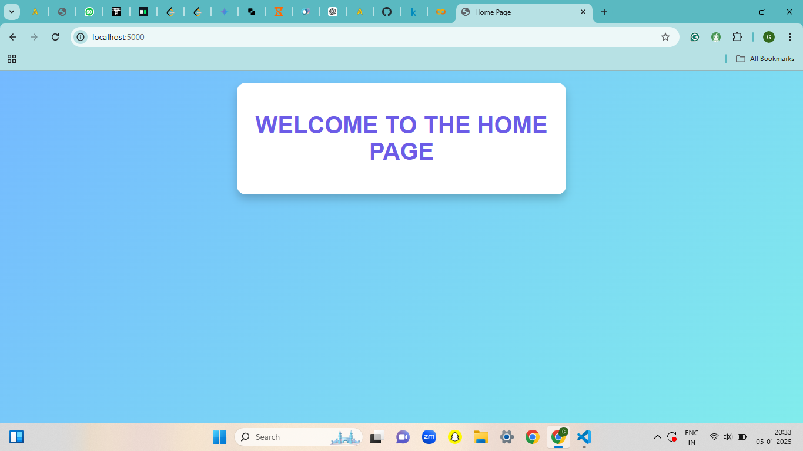

# Student_Performance_3
3rd project in the series of 100 end to end.

  
---

## **Project Overview**
Students' academic performance is a crucial factor in identifying their strengths and areas for improvement. **Student Performance Indicator** uses machine learning to predict math scores based on various features like reading and writing scores, gender, and parental education. The project supports educators by providing actionable insights to enhance learning outcomes.

---

## **Features of the Project**  
- **Predictive Modeling:** Forecast math scores using advanced regression techniques.  
- **Interactive Training:** Trigger model training directly from the app interface with real-time feedback.  
- **Robust Deployment:** Integrated Flask API with Docker support for containerized deployment.  
- **Enhanced User Experience:** A multicolor, responsive design for seamless interaction.  

---

## **Dataset Description**  

### **Problem Statement**  
The project aims to predict students' math scores using their demographic and academic performance attributes.  

- **Total Entries:** 1,000+  
- **Features:** 7 input attributes and 1 target attribute (Math Score).  

### **Key Features**  
- `gender`: Gender of the student (male/female).  
- `race/ethnicity`: Group designation.  
- `parental_level_of_education`: Parent's highest education level.  
- `lunch`: Type of lunch (standard/free or reduced).  
- `test_preparation_course`: Test preparation status (completed/not completed).  
- `reading_score`: Reading score achieved by the student.  
- `writing_score`: Writing score achieved by the student.  
- **Target Variable:** Math Score (Numerical value).  

---

## **Project Architecture**  

### **Pipeline Flow**  
1. **Data Ingestion:**  
   - Load and preprocess dataset.  
   - Handle missing values and outliers.  

2. **Data Transformation:**  
   - Encode categorical variables.  
   - Scale numerical features using standardization.  

3. **Model Training:**  
   - Train regression models to predict math scores.  
   - Optimize models using hyperparameter tuning.  

4. **Evaluation:**  
   - Assess model performance using metrics like Mean Absolute Error (MAE) and R² score.  

5. **Deployment:**  
   - Flask API for prediction.  
   - Docker for containerization.  

---

---

## **Tools and Technologies**  
- **Languages & Libraries:** Python, Pandas, Scikit-learn, Matplotlib, Seaborn  
- **Frameworks:** Flask  
- **Deployment:** Docker, AWS  
- **Version Control:** GitHub  
- **CI/CD:** GitHub Actions  

---

## **How to Run the Project**  

### **1. Clone the Repository**  
```bash
https://github.com/Govindkv/Student_Performance_3.git
```

### **2. Create a Virtual Environment**  
```bash
python -m venv venv
source venv/bin/activate  # On Windows: venv\Scripts\activate
```

### **3. Install Dependencies**  
```bash
pip install -r requirements.txt
```

### **4. Run the Flask App**  
```bash
python app.py
```
Visit [http://127.0.0.1:5000](http://127.0.0.1:5000) in your browser.  

---

## **Deployment Guide**  

### **Using Docker**  
1. **Build the Docker Image:**  
   ```bash
   docker build -t student-performance-indicator .
   ```
2. **Run the Docker Container:**  
   ```bash
   docker run -p 5000:5000 student-performance-indicator
   ```
3. **Access the application at [http://localhost:5000](http://localhost:5000).**  

### **Using AWS**  
- Push Docker image to AWS Elastic Container Registry (ECR).  
- Deploy the container to AWS Elastic Kubernetes Service (EKS) or Elastic Beanstalk.  

---

## **Model Insights**  
- **Feature Importance:** Writing and reading scores are the strongest predictors of math performance.  
- **Metrics:** Achieved an R² score of 0.95, indicating a high level of prediction accuracy.  
- **Visualization:** Feature importance and residual plots for better interpretability.  

---

## **Screenshots and Visuals**  

|  |  |  
|:---------------------------------------:|:---------------------------------------:|  
| **Homepage UI**                         | **Training Process**                    |  

|  |  |  
|:-------------------------------------------------:|:---------------------------------------------------------:|  
| **Prediction Input UI**                           | **Prediction Result Output**                              |  


---

## **Future Work**  
- Expand dataset for better generalization.  
- Incorporate real-time data ingestion for live student performance monitoring.  
- Build a mobile-friendly interface for wider accessibility.  

---

### Key Tools
- 
- 
- 
- 

---

## **Connect and Explore**  
- [GitHub Repository](https://github.com/yourusername/student-performance-indicator)  
- [Project Portfolio](https://govindkv.github.io/)  
- [LinkedIn](https://www.linkedin.com/in/govind-kv/)  
